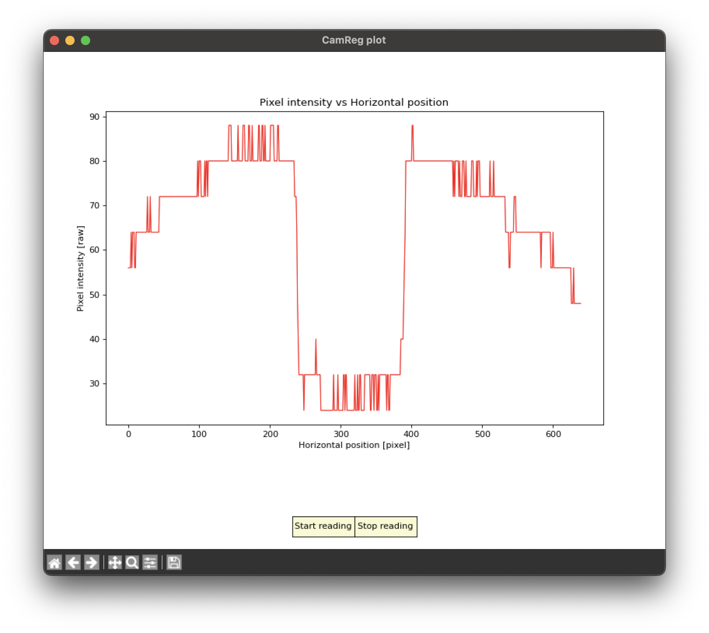
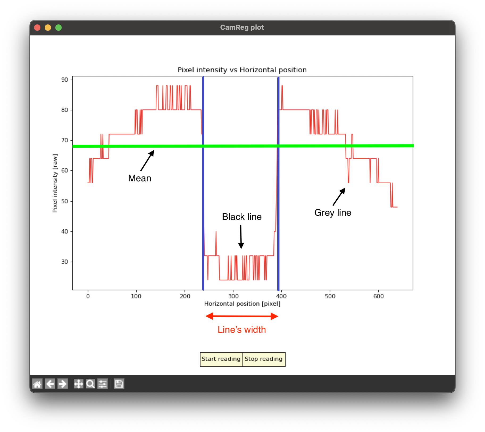
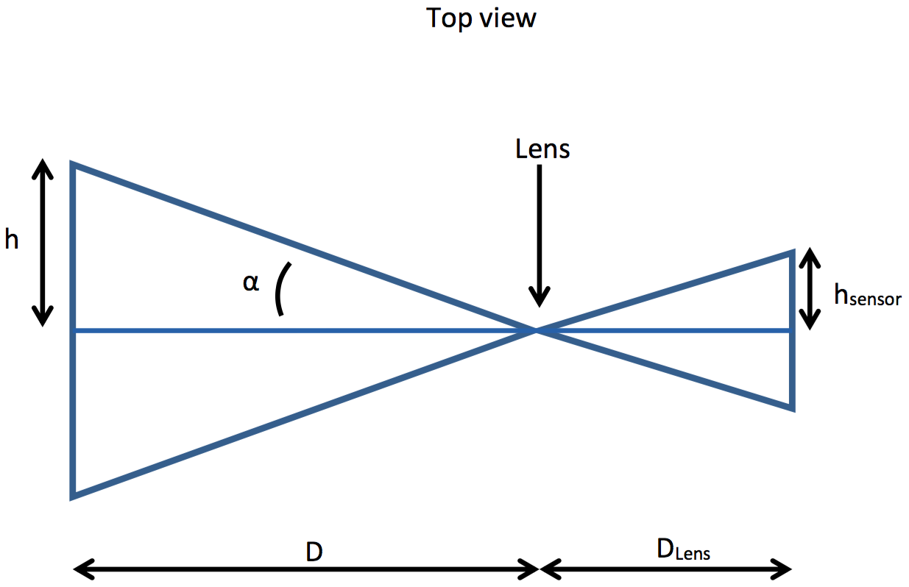

# Task 1: Reading and sending an image
- Almost all the code is already written. The only thing left to do is to write a little piece of code to extract one color of the image and to call the function to send it to the computer over the UART3 port of the microcontroller
- As said in the instructions, we send the image only once every 2 time in order to not flood the computer
- Have a look at the solution code at [Code block 1](#code-block-1)

- In this code we extract the red color, thus we need to keep only the 5 MSbits (0xF8 in hexadecimal value) of the first **uint8_t** value (the MSByte in **big-endian** format for 16 bits value), the second value isn't useful since we only want the red part
- As the sheet is white, it reflects a bit of the three primary colors, when the black reflects in theory nothing. This is why the black line can be detected by looking where the values of the pixels drop near zero and then recover
- We can see a typical plot when the robot is in front of the sheet in the [Figure 1](#figure-1) 
- If you point the camera to other directions, you will see that the plot will adapt to always be in the same range to not saturate the values
- This is simply because the camera is configured in auto brightness mode
- Therefore if you point the camera at a dark object and a bright object at the same time, you will see a huge difference of value between the two objects and the brighter one will certainly have saturated values, but then, if you point the camera only on the bright object, then the values adapt and are not saturated (except if you point it at a light)

>### Code block 1
>```c
>// Extraction of the red color
>static THD_WORKING_AREA(waProcessImage, 1024);
>static THD_FUNCTION(ProcessImage, arg) {
>
>    chRegSetThreadName(__FUNCTION__);
>    (void)arg;
>
>    uint8_t *img_buff_ptr;
>    uint8_t image[IMAGE_BUFFER_SIZE] = {0};
>
>    bool send_to_computer = true;
>
>    while(1){
>        //waits until an image has been captured
>        chBSemWait(&image_ready_sem);
>        //gets the pointer to the array filled with the last image in RGB565    
>        img_buff_ptr = dcmi_get_last_image_ptr();
>
>        //Extracts only the red pixels
>        for(uint16_t i = 0 ; i < (2 * IMAGE_BUFFER_SIZE) ; i+=2){
>            //extracts 5 MSbits of the MSByte
>            //takes nothing from the second byte
>            image[i/2] = (uint8_t)img_buff_ptr[i] & 0xF8;
>        }
>
>        ...
>
>        ...
>
>        if(send_to_computer){
>            //sends to the computer the image
>            SendUint8ToComputer(image, IMAGE_BUFFER_SIZE);
>        }
>        //invert the bool
>        send_to_computer = !send_to_computer;
>    }
>}
>```

>### Figure 1
>Typical plot when the robot is in front of the sheet
    <p float="left">
    
    </p>

# Task 2: Measuring the capture time of the camera
- To measure the time, we use the **chVTGetSystemTime()** functions
- Then we can print the difference between the time at the beginning of the capture and the time after, by putting the following functions around the functions to capture and wait for a ready image

>### Code block 2
>```c
>systime_t time;
>time = chVTGetSystemTime();
>
>//-> Functions to measure <-//
>
>chprintf((BaseSequentialStream *)&SDU1, "capture time = %d\n", chVTGetSystemTime()-time);
>```
- Here we chose to send the time measurement to the USB port of the microcontroller, thus if we don't plug the USB cable and don't connect to the USB port with a terminal program, the code will be stuck here until we connect
- The capture time measured is about **38ms**, it corresponds to the time the camera takes to transmit its whole pixel's matrix (776x516)
- Indeed, the PO8030D has more pixels sent than the ones usable. This is mainly for synchronization purpose and internal stuff. Then during the transmission it indicates with dedicated signals if a pixel sent should be taken into account or not. Thus, with the configuration done in the code, even if the camera sends 776x516 pixels, it only indicates the USED_LINE and USED_LINE + 1 th lines of 640 pixels as valid pixels and the other pixels are ignored by the microcontroller
- Another thing to take into account is the pixel clock, even if the microcontroller sends a clock of 21MHz to the camera, the camera sends the pixels at half of the clock sent by the microcontroller
- Putting it all together leads to the [Equation 1](#equation-1): 
>### Equation 1
>$\frac{FrameHeight \cdot FrameWidth}{PXCLK/2} = \frac{776 \cdot 516}{21000000/2} \simeq 0.038 ms$
- If we cover the camera with something, or point it to something dark enough, then the integration time of the pixels increases
- As said in the Task 1, this is because the camera is in auto brightness mode
- Then to adapt the sensibility of the pixels, it needs to sample a longer time to get more light
- The maximum capture time measured with this configuration is about **76ms**

# Task 3: Desynchronization
- Here by setting the sleep duration of the `CaptureImage` thread to **12ms**, we obtain a capture time of about **64ms**
- This is totally coherent as the thread takes 50ms in total (38ms capture time + 12ms sleep)
- Thus the camera has begun to send a new image 12ms before the thread wakes up, so we need to wait 26ms more to end this image and begin a new one and then wait the 38ms of the frame transfer. It makes $26+38=64ms$, which is the result we obtained

# Task 4: Line detection function
- There are many ways to detect the black line
- One relatively simple and robust is to detect when we have a falling slope and a rising slope
- It will give us the borders of the lines and with this we can know its width in pixels and its position in the image (part of the bonus point)
- Here is an example of implementation, it reads the image from left to right and searches for a falling slope. If no falling slope has been found, we stop the function but if one has been found, then it saves its position and continues to read the image to find the rising slope
- It also computes the mean of the values to have a threshold for the slope detection
- Using the mean is useful to have an adaptive threshold, for example to get rid of the brightness changes
- The [Figure 2](#figure-2) explains the detection process
- Some parameters such as **SLOPE_WIDTH** have been used too in order to filter the noise
- It also try to find another black line if a too small line has been detected (for example the little grey line on the sheet) and finally limits the maximum line width and if no line has been found, it returns the last line width found

>### Figure 2
>Explanation of the line detection
    <p float="left">
    
    </p>

>### Code block 3
>```c
>//process_image.c
>...
>static float distance_cm = 0;
>static uint16_t line_position = IMAGE_BUFFER_SIZE/2;  //middle
>...
>
>/*
> *  Returns the line width extracted from the image buffer given
> *  Returns 0 if line not found
> */
>  uint16_t extract_line_width(uint8_t *buffer){
>
>    uint16_t i = 0, begin = 0, end = 0, width = 0;
>    uint8_t stop = 0, wrong_line = 0, line_not_found = 0;
>    uint32_t mean = 0;
>
>    static uint16_t last_width = PXTOCM/GOAL_DISTANCE;
>
>    //performs an average
>    for(uint32_t i = 0 ; i < IMAGE_BUFFER_SIZE ; i++){
>        mean += buffer[i];
>    }
>    mean /= IMAGE_BUFFER_SIZE;
>
>    do{
>        wrong_line = 0;
>        //search for a begin
>        while(stop == 0 && i < (IMAGE_BUFFER_SIZE - WIDTH_SLOPE))
>        { 
>            //the slope must at least be WIDTH_SLOPE wide and is compared
>            //to the mean of the image
>            if(buffer[i] > mean && buffer[i+WIDTH_SLOPE] < mean)
>            {
>                begin = i;
>                stop = 1;
>            }
>            i++;
>        }
>        //if a begin was found, search for an end
>        if (i < (IMAGE_BUFFER_SIZE - WIDTH_SLOPE) && begin)
>        {
>            stop = 0;
>            
>            while(stop == 0 && i < IMAGE_BUFFER_SIZE)
>            {
>                if(buffer[i] > mean && buffer[i-WIDTH_SLOPE] < mean)
>                {
>                    end = i;
>                    stop = 1;
>                }
>                i++;
>            }
>            //if an end was not found
>            if (i > IMAGE_BUFFER_SIZE || !end)
>            {
>                line_not_found = 1;
>            }
>        }
>        else//if no begin was found
>        {
>            line_not_found = 1;
>        }
>
>        //if a line too small has been detected, continues the search
>        if(!line_not_found && (end-begin) < MIN_LINE_WIDTH){
>          i = end;
>          begin = 0;
>          end = 0;
>          stop = 0;
>          wrong_line = 1;
>        }
>    }while(wrong_line);
>
>    if(line_not_found){
>        begin = 0;
>        end = 0;
>        width = last_width;
>    }else{
>        last_width = width = (end - begin);
>        line_position = (begin + end)/2; //gives the line position.
>    }
>
>    //sets a maximum width or returns the measured width
>    if((PXTOCM/width) > MAX_DISTANCE){
>        return PXTOCM/MAX_DISTANCE;
>    }else{
>        return width;
>    }
>}
>```

>### Code block 4
>Call of the function in the thread ProcessImage
>```c
>    ...
>    uint16_t lineWidth = 0;
>    ...
>    //search for a line in the image and gets its width in pixels
>    lineWidth = extract_line_width(image);
>    ...
>```

# Task 5: Distance conversion
- There are several ways to find how to convert the distance between the robot and the paper with the line width measured by the camera
- One example here is with simple trigonometry, we know that the angle of view of the camera is about 45 degrees and we know the distance between the lens and the sensor is fixed and can't change
- We also know the width in pixels of the sensor and the width of the printed line
- With all these information, we can find a relation between the line width and the distance
- The [Figure 3](#figure-3) shows the situation
>### Figure 3
>Drawing of the situation to convert the line width into the distance
    <p float="left">
    
    </p>

- First, let's pose the relations we know with this drawing :
>### Equation 2
>$\tan(\alpha) = \frac{h}{D} = \frac{h_{sensor}}{D_{lens}}$
- where:
    - $h$: half the width of the printed line in cm
    - $\alpha$: half the angle of view of the camera in degree
    - $h_{sensor}$: half width in pixel of the sensor
    - $D$: the distance between the sheet and the robot
    - $D_{lens}$: the distance between the lens and the sensor in pixel
    
- $D_{lens}$ is fixed and we assume the light goes only on the usable pixels (640 pixels wide), thus we can find $D_{lens}$ very easily
>### Equation 3
>$D_{lens}=\frac{h_{sensor}}{\tan(\alpha)} = \frac{320}{\tan(22.5)} \simeq 772.55\,\text{pixels}$

- Now with the help of the equations [2](#equation-2) and [3](#equation-3), we can find a relation between the line width and the distance between the sheet and the robot
- With the use of a ruler, we also find that the line width is 2cm
- This gives us the following formula to convert the line width into the distance
>### Equation 4
>$D=\frac{h * D_{lens}}{h_{sensor}} = \frac{2 * 772.55}{h_{sensor}} \simeq \frac{1545}{h_{sensor}}$
- After some adjustments, the value used in the correction code is **1570**
- Another quick way to find this formula is by instinct:
    - Assume the relation between the distance and the line width can be expressed by a rule of three
    - We need some measurements and some tries to find the formula
    - We can try to multiply the line width with the distance or to divide them
    - Finally we find that multiplying the two gives more or less always the same result
    - This result is the value we found earlier and it gives us the good relation to use
    - You can even put these measurements on a Google Sheet and plot them to compare your formula with your measurements, it gives you a quick way to adjust the value to take for the conversion
- On the following code, you can see the implementation of the conversion, **PXTOCM** being the value found before
>### Code block 5
>Conversion from line width to distance
>```c
>    ...
>    distance_cm = PXTOCM/lineWidth;
>    ...
>```

# Task 6: Writing a PI regulator
- Here the implementation is very simple and is shown below
- In the `PiRegulator` thread, you can see some additional stuff used to make the robot rotate to follow the line
- It works as a P regulator for the rotation and has a threshold too in order to not rotate when the goal position is very close to the one of the robot
- Notice the use of the functions **get_line_position** and **get_distance_cm**, they are used to get the values of the variables coming from the file **process_image.c** 
- Here are some explanations :
    - **distance_cm** is continuously modified by the thread `ProcessImage` and we need to transmit this variable to others functions
    - We could declare it at the begining of the file as a global variable but is is something not adviced in general in order to avoid problems (we could have a function on another file that uses a variable with the same name or a random function that could modify this variable)
    - 💡 In general it's really not safe to have global variables
    - 💡 A good thing to do in this case is to declare it as a static global variable at the begining of the file. therefore it is global for every functions of this file but no function outside this file can access it
    - This way we control the access to the variable
    - ⚠ But we still need to be sure to not create problem, since every functions inside this file can do what it want with the variable
    - 💡 If only the thread were using this variable, we would simply have declared it inside the thread
- **get_line_position** works exactly as **get_distance_cm** except it returns **line_position** instead of **distance_cm**

>### Code block 6
>PI regulator function in pi_regulator.c
>```c
>//simple PI regulator implementation
>int16_t pi_regulator(float distance, float goal){
>
>    float error = 0;
>    float speed = 0;
>
>    static float sum_error = 0;
>
>    error = distance - goal;
>
>    sum_error += error;
>
>    speed = KP * error + KI * sum_error;
>
>    return (int16_t)speed;
>}
>```

>### Code block 7
>Call of the PI regulation function in the PiRegulator Thread
>```c
>static THD_WORKING_AREA(waPiRegulator, 256);
>static THD_FUNCTION(PiRegulator, arg) {
>
>    chRegSetThreadName(__FUNCTION__);
>    (void)arg;
>
>    systime_t time;
>
>    int16_t speed = 0;
>    int16_t speed_correction = 0;
>
>    while(1){
>        time = chVTGetSystemTime();
>        
>        //computes the speed to give to the motors
>        //distance_cm is modified by the image processing thread
>        speed = pi_regulator(get_distance_cm(), GOAL_DISTANCE);
>        //computes a correction factor to let the robot rotate to be in front of the line
>        speed_correction = (get_line_position() - (IMAGE_BUFFER_SIZE/2));
>
>        //if the line is nearly in front of the camera, don't rotate
>        if(abs(speed_correction) < ROTATION_THRESHOLD){
>            speed_correction = 0;
>        }
>
>        //applies the speed from the PI regulator and the correction for the rotation
>        right_motor_set_speed(speed - ROTATION_COEFF * speed_correction);
>        left_motor_set_speed(speed + ROTATION_COEFF * speed_correction);
>
>        //100Hz
>        chThdSleepUntilWindowed(time, time + MS2ST(10));
>    }
>}
>```

# Task 7: Finding Kp
- Here the Kp we kept is **800**
- It is arbitrary as a bigger or smaller value can work to, however it seemed to be more stable with 800
- 💡 This is not the only correct answer as a PID in general is very dependent on the environment and there are multiple ways to determine its coefficients
- To find Kp we simply commented the integral part of the computation and increased Kp until the robot became unstable (oscillations), it ensures you the quickest response you can obtain with a P regulator
- When Kp is too small, you can go drink a coffee before the robot reaches its goal position and if it is too big, it will oscillate around the goal, and could become crazy if Kp is really big
- ⚠ Also, with only a P regulator, we cannot correct the static error. So when we move the paper at a constant speed, we have a constant error the P regulator cannot correct, we must add an integral part to correct this

# Task 8: Playing with Ki
- Ki accumulates the error we have in the system, thus when we move the paper at constant speed, it enables the robot to accelerate in order to try to correct the constant error
- But with the e-puck2, the maximum speed of the motors is not that big and we have to move the paper relatively slowly to see this correction without saturating the motors
- Having a big Ki can quickly make the system unstable as it can accumulate too quickly the error and when the robot reaches the goal position, it continues to move because the integral sum is too big
- We can also see that a Ki which works well at small distances of the goal can create problems if we put the robot too far from the goal position, indeed the integral sum goes too high to avoid oscillations
- A solution could be to lower Ki, but then it maybe won't have enough effect when the robot is at closer distances of the goal position

# Task 9: ARW and finding Kp and Ki
- A simple solution to the integral accumulation problem can be to limit its maximum and minimum values
- Doing this let us use a Ki that corrects the static error at close distances of the goal, or when we move the paper, and which has limited effect when the robot is far from the paper
- The limit can be chosen experimentally by trying different values
- Here, we limited it to not go higher than **MOTOR_SPEED_LIMIT/KI**
- This way, when the sum is multiplied by Ki, it can gives a maximum value of **MOTOR_SPEED_LIMIT**, other limitation values can be chosen but this one is relatively intuitive
- The coefficients we kept are **Kp = 800** and **Ki = 3.5**
- Again other couple of values are possible to have a responsive system
- Another problem that could appear is the robot always trying to move a little once on the goal position, cause by the noise of the camera
- Then the distance measurement always oscillates a little and it is repercuted in the PI regulator
- A simple solution for this can be to not compute the PI part if the error is under a chosen threshold
- You can see in [Code block 8](#
block-8) the same implementation of the PI regulator function as [Code block 6](#code-block-6) but with the ARW and the threshold

>### Code block 8
>PI regulator function with ARW and threshold in pi_regulator.c
>```c
>//simple PI regulator implementation
>int16_t pi_regulator(float distance, float goal){
>
>    float error = 0;
>    float speed = 0;
>
>    static float sum_error = 0;
>
>    error = distance - goal;
>
>    //disables the PI regulator if the error is to small
>    //this avoids to always move as we cannot exactly be where we want and 
>    //the camera is a bit noisy
>    if(fabs(error) < ERROR_THRESHOLD)
>        return 0;
>
>    sum_error += error;
>
>    //we set a maximum and a minimum for the sum to avoid an uncontrolled growth
>    if(sum_error > MAX_SUM_ERROR)
>        sum_error = MAX_SUM_ERROR;
>    else if(sum_error < -MAX_SUM_ERROR)
>        sum_error = -MAX_SUM_ERROR;
>
>    speed = KP * error + KI * sum_error;
>
>    return (int16_t)speed;
>}
>```

# Task 10: Reducing the PI regulator frequency
- By reducing the frequency of the regulator, we degrade its effects on the system
- When the frequency is lower, Ki need to be adapted in order to try to get the same results as with 100Hz (because the sum doesn't grow at the same rate !)
- It is better to have a PI regulator that works at higher speed than the measurements or at equal speed, but in no case it is better to have a PI regulator that works slower than the measurements
- If the frequency is high, then it simply means the regulator can react faster.
- Thus here with 10Hz and the same Kp and Ki, we can observe more oscillations around the goal position when moving the paper and then waiting for the robot to stabilize itself at the goal position, we also clearly see the reactions of the robot are slower than before and the effect of Ki is less visible

# Task 11: Making the robot follow the line with rotation
- You can see what has been added to achieve this in the code of Task 4 (Line detection function) and in the code of Task 6 (Writing a PI regulator)

# Task 12: Playing with **USED_LINE** value
- The initial **USED_LINE** value of 200 allows the camera to look at the right height of the image in order to see correctly the black line for a distance with the robot between 3 to 20 cm.
- The little play of the robot with the floor and the camera with its support can slightly changes the azimuth, so the viewing height.
- In principle this value should allow all robots to function properly.
- Using a value of 450 will make look down and therefore rather see the ground as soon as the distance increases. Depending on the distance, the code will no longer detect a black line.
- On the other hand, using a value of 0 will make look up and therefore rather see multicolored lines as soon as the distance increases. Depending on the distance, the code will not be able to detect correctly 1 single black line.
- Working with a black or white background and choosing the detection colour(s) can also have certain advantages/disadvantages.
- Ambient light (also dependent on the robot LEDs) as well as contrast between objects/background can more or less significantly impact a detection algorithm.
- In summary, it is important to make good use of the camera’s functionality to take advantage of it. It is therefore very useful to have a visualization in color of lines used by the algorithm in order to know what is targeted and what can be obtained from it.


