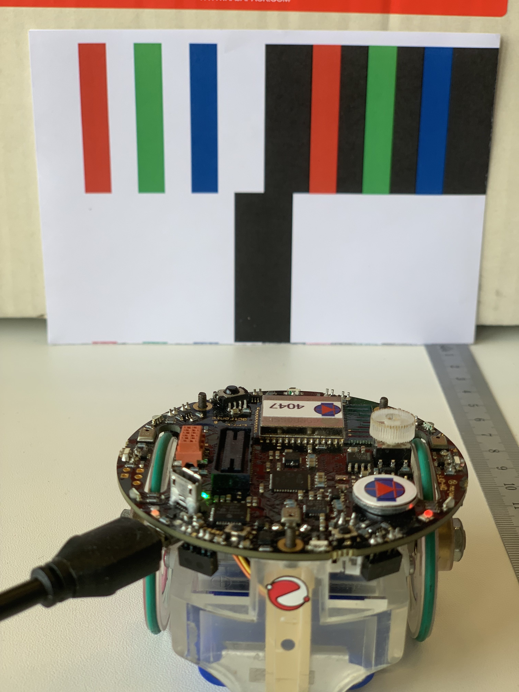

# Introduction
- Setting of a distance between the robot and a visual object with an optical tracking and a PI regulator
- ChibiOS: a RTOS optimized for the execution speed and the size of the code, it contains a lot of drivers to use the peripherals of the STM32 families
- `Goal`: To program in a real case a PI regulator and a simple, but real time, image processing in order to keep a given distance between a printed sheet and the robot
- `⏱ Duration`: 4 hours
- `Equipment`: EPuck2 robot, ChibiOS library, Python

# Main goal
- The goal of this practical session is to implement a PI regulator in order to keep a given distance between the robot and a vertical black line printed on a white sheet by using the camera to detect it and measure the distance
- This will be achieved by reading one line of pixels of the camera, processing it to find the black line and compute the distance and writing and setting a simple PI regulator to control the motors

# Methodology
- To achieve the main goal, you will go through the following steps:
    - Understanding how to communicate with the e-puck2 throught USB or Bluetooth
    - Understanding how the camera works, what are the values returned and what the operating conditions are
    - Implementing and verifying an algorithm to find the line and compute the distance
    - Using the distance measurement to write a PI regulator used to keep the robot at a certain distance
    - Verifying the characteristics of the regulator and correcting some implementation's problems with an ARW (Anti Reset Windup) and/or other mechanisms


## ⚠ Setup of the project
- execute the command `git checkout reference/TP4_Exercise`
    - all the files related to this lab should now be downloaded in your Workplace folder

# e-puck2_main-processor library
For TP1 and TP2 you have used `ST` library in order to see how to code at low level:
- This allowed you to see how to access and manage the STM32F407 peripheral registers (Clock's module, GPIOs and Timers) in order to communicate properly with the e-puck2 components (LEDs, motors).   

For TP3 you have used `e-puck2_main-processor` as library but everything about I2C and IMU was duplicated in the src folder of TP3 in order to "hide" the original IMU driver and ask you to complete it:
- This allowed you to see how to code an IMU driver and start to work with ChibiOS.
***
> From TP4 and including for your mini-projects, you will use `ONLY and COMPLETELY` **e-puck2_main-processor** as library. It contains nearly all the drivers needed to use the functionalities of the robot and it uses ChibiOS to run. 
***
- For example the files to use the I2C and the IMU in TP3 were taken from this library
- You are free to look at it to see how things are done if you want, or simply to see what is possible to do with it
- All the functionalities you will use in this TP come from e-puck2_main-processor
- This is the library you will use for the mini-projects too
- The project you have for this practical session uses a simple makefile which sets some parameters, and then calls the bigger makefile of the e-puck2_main-processor library
***
> In fact e-puck2_main-processor is a demo program written for the e-puck2 but it is configured as a "library" for your TPs and mini-project
***
# Using the Bluetooth of the EPuck2
1) read [Presenting the EPuck2](https://github.com/EPFL-MICRO-315/TPs-Student/wiki/EPuck2-Presenting-the-EPuck2)
2) read [EPuck2 - Bluetooth](https://github.com/EPFL-MICRO-315/TPs-Student/wiki/EPuck2-Bluetooth)

## Functions to communicate with ChibiOS
- ChibiOS offers several functions to send or receive data
- Thanks to the HAL (Hardware Abstraction Layer) implementation in ChibiOS, you can use the same functions with the UART3 or the USB
- The difference is which pointer you will use as argument in the functions.
Below are some examples of communication functions :

>### Code block 1
> ```c
> //formatted print of the variable "time" to SD3 (UART3)
> chprintf((BaseSequentialStream *)&SD3, "time = %d \n", time);
> 
> //formatted print of the variable "time" to SDU1 (USB)
> chprintf((BaseSequentialStream *)&SDU1, "time = %d \n", time);
> 
> //sends the buffer "data" of size "size" to SD3 (UART3)
> chSequentialStreamWrite((BaseSequentialStream *)&SD3, data, size);
> 
> //reads from SDU1 (USB) "nb_values" values and stores them to the buffer "data"
> chSequentialStreamRead((BaseSequentialStream *)&SDU1, data, nb_values);
> ```

- What you need to remember are the pointers **SDU1** (USB) and **SD3** (UART3) which indicate which interface you will use to communicate
- The cast **(BaseSequentialStream *)** is here to convert the type of the pointer into the good one
- It works without it but you will have warnings during the compilation

# Threads in the code
The code given uses 3 threads:
- `PiRegulator`: Thread doing the PI regulator stuff
    - It runs at a given frequency, no matter if a new image has been processed or not (doesn't wait for new distance measurements from the thread `ProcessImage`)  
    - This is done because a PI regulator gives better results when it runs fast, even if the information it uses are refreshed slower. But the frequency must be stable
- `CaptureImage`: Thread capturing the images with the camera
    - It only launches a new capture, then waits for the capture to be finished, when it is the case it releases a semaphore to tell a new image is ready and begins a new image capture
- `ProcessImage`: Thread processing the images captured by CaptureImage
    - It is used to process the image, thus it needs to know when a new image is ready
    - It is done by looking at the same semaphore as the thread `CaptureImage`

The synchronization between `CaptureImage` and `ProcessImage` works like as follow:

1) `CaptureImage` is a producer and releases the semaphore when a new image is ready
2) `ProcessImage` is a consumer and waits until the semaphore is released. When it is the case, it can take it. To be able to take the semaphore on the next iteration, it will again need to wait until the semaphore is released
- 💡 By only releasing the semaphore with the producer thread and only taking it with the consumer thread, will ensure a correct synchronization between the two threads
- 💡 Note : All the wait functions provided by ChibiOS put the concerned thread into sleep to wait. In fact every functions implying to wait on something have this behavior
- 💡 Read more on semaphore at [https://www.chibios.org/dokuwiki/doku.php?id=chibios:documentation:books:rt:kernel_counter_semaphores](https://www.chibios.org/dokuwiki/doku.php?id=chibios:documentation:books:rt:kernel_counter_semaphores)

# Camera
- 👉 read [EPuck2 - Camera](https://github.com/EPFL-MICRO-315/TPs-Student/wiki/EPuck2-Camera)
- For the practical session, you will need to extract the color of your choice to only use one color information for the line detection
- As the line is black and the sheet is white, the choice of color should not change the result a lot
- But it is sure you will have more information if you use the green for example, as it is coded with 6 bits instead of 5 for the others
- ⚠ Careful, **img_buff_ptr** is an **uint8_t** buffer, this means you will read your 16 bits pixel through two **uint8_t** values in **big-endian** format
- In the loop you will write code to extract one color information, **img_buff_ptr** will have a size two times bigger than the size of the buffer you will use to store one color value

# Sending the data to the computer
- In this Lab, you will use a Python script to plot the lines of pixels taken with the e-puck2
- You can use the following function on the e-puck2 side to send the one-line images to the computer:

>### Code block 5
>```c
>//sends the data buffer of the given size to the computer
>SendUint8ToComputer(uint8_t* data, uint16_t size);
>```

- Then on the computer side you need to run the python script **plotImage.py**
- You have at this time only 1 possibility to run this script: You must directly launch the python script but you must to have python3 installed on your computer.

- You can refer to the **readme.txt** located into the **Scripts\_python** folder provided for more informations about how to install python and the needed libraries

> `Task 1`
>- In the thread `ProcessImage`, use the code provided to read images from the camera and write a simple loop to extract one color of your choice from the images (you need to do bits manipulations)
>- Then send them to the computer to visualize them. You need to send them relatively slowly if you don't want to loose bytes
>- 💡 For example you can send only one image over two
>- Place the robot in front of the sheet as show on [Picture 1](#picture-1).    
You can receive this page, already printed and cut, at the beginning of the TP, but you can also find it in the pictures subdirectory.
>
>- How does the black line on the lower part of the image appear on the plot ? Is it normal or not ?
>### Picture 1
>Robot is in front of the sheet
>
> ⚠ It misses here a little grey line! Photo will be corrected soon!
    <p float="left">
    
    </p>
>- How do the values of the plot change when the camera looks at other things in the room ? Why does it behave like that ? (Hint : try to have something dark and something brighter in the same image)

> `Task 2`
>- Measure the time used to take a photo with the camera in the thread `CaptureImage` 
>- You can use the function **chVTGetSystemTime()** which is already used to compute the sleep duration in the thread `PiRegulator`
>- This measure uses the system tick of ChibiOS, so it counts in milliseconds
>- As you don't need to be more precise, you can use it instead of a timer which is more precise
>- What happens to the capture time if you cover the camera with your hand ?
>- 💡 Hint : You can use **chprintf()** to send some variables to the computer in order to know if your function works well or not
>- Since you already are sending the images to the computer through the UART3 of the MCU with the dedicated functions showed before, you have 3 choices to use **chprintf()** :
>   1) Stop to send the images from the MCU and therefore stop the Python script on the computer side (close too the used serial port).    
Then use **chprintf()** with **SD3** (UART3) and a serial terminal on the computer.    
This solution is not very practical because you cannot see the 2 information simultaneously.
>   2) Continue to send images and use **chprintf()** with **SDU1** (USB). Then you must use a serial terminal on the computer to read these time measures.    
This solution allows to see the 2 information simultaneously but requires the use of the Python script and a serial terminal. On the other hand, it is simple to implement.
>   3) Enhance the protocol of the Python script in order to be able to manage and display message for example by using another function like SendTextToComputer and its counterpart in the Python code.    
This solution is interesting because it only requires the use of a Python script, but the protocol adaptation is a bit more complex.

- The way the camera is configured is to send its images in a continuous way
- Thus on the MCU, you read only when you want to get an image
- One drawback of this behavior is the synchronization
- If you want to read an image while an image is already being streamed by the camera, then the MCU waits the beginning of the next image to capture it and you lose time waiting for the image to begin
- This is why you have a thread dedicated in the capture of the images
- Like that, you can be sure the synchronization is kept and you work with the images on another thread

> `Task 3`
>- Add a sleep duration of 12ms into the thread `CaptureImage` to see the desynchronization
>- Is the new capture time coherent ? 
>- **Do not forget to remove the thread sleep afterward in order to have a working function for the next tasks**

> `Task 4`
>- Now that you are able to read an image, you need to write a detection function to determine where is the black line and what is its width in pixels
>- Call this function in the thread `ProcessImage`
>- Verify you obtain a decent detection for distances between about 3 and 20 cm.
>- How to make this detection independent of the ambient light?
>- 💡 Hint : average

> `Task 5`
>- Find a way to convert the width in pixel of the black line to the distance in cm between the paper and the camera of the robot. Test your conversion and adjust it if necessary. The resulting function can be as simple as a division
>- Store your result in the variable **distance_cm** declared on top of the code
>- 💡 Hint : you can measure the distance between the robot and the sheet and send the width in pixels to the computer

# PI Regulator
- Now you will have to write a PI regulator in order to control the motors to keep the robot at a given distance of the printed line
- You can read this page by Ferdinand Piette ([Intuitive explanation on how to implement a PID in c. [French]](http://www.ferdinandpiette.com/blog/2011/08/implementer-un-pid-sans-faire-de-calculs/)) to implement a simple discrete PI regulator if you have no clue on how to do it
- You can find in the file **pi_regulator.c** a thread named `PiRegulator` which is meant to run the PI regulator at a given frequency
- At the end, you can find the functions to set a speed to the motors
- For now they are commented to not move the robot until you have written the PI regulator
- The motor's functions take speed in $step/s$ and not in $cm/s$ like in TP2
- To access the distance computed in the thread `ProcessImage`, use the function **get_distance_cm**

> `Task 6`
>- Write a function that implements a PI regulator in the file **pi_regulator.c** and call it in the thread `PiRegulator`, or write directly the PI regulator into the thread
>- Use the distance computed in the thread `ProcessImage` in the PI regulator and a goal distance of **10cm**
>- Why is **distance_cm** declared as static outside a function ?
>- What does it mean ?
>- Try to understand why you use a function to get the variable instead of directly accessing it

> `Task 7`
>- Try your PI regulator with only the Proportional coefficient (Kp)
>- Use a little Kp at first and then increase it
>- Don't forget to uncomment the functions to set the speed of the motors in order to apply the command speed computed in the PI regulator
>- Try to find experimentally which Kp gives the best performance in your case
>- What happens when Kp is too big or too small ?
>- Is the distance correct when you move the paper at a constant speed ? Why not ?
>- 💡 Note : the motor's library already limits the speed you can give to the motors to $\pm2200 step/s$

> `Task 8`
>- Now use the integral coefficient (Ki) in your PI regulator and play a little with the Ki coefficient
>- What is the effect of Ki in the system ? Is it better when you move the paper at a constant speed ?
>- What happens with the integral part of the PI regulator when the robot is too far from the 10cm goal distance (or too close) ?
>- 💡 Hint : print the value of the integral sum

> `Task 9`
>- Implement a simple ARW system by limiting the minimum and maximum values of the integral sum and then try to find experimentally which couple of Kp and Ki gives the best performance in your case
>- Depending on your PI regulator, other mechanisms such as threshold can be used to correct other problems you could encounter
>- For example when the robot is very close to the goal distance, then depending on you Kp and Ki, it will always move a bit because of the noise on the camera

> `Task 10`
>- Now reduce the frequency of the `PiRegulator` thread from 100Hz to 10Hz
>- What is the result with the Kp and Ki previously found ?
>- Is it better or worse ?
>- Why ?

#  **BONUS**
> `Task 11`
>- If you want, you can also add a simple control of the rotation of the robot in order to try to follow the black line
>- This way the robot will keep the goal distance with the paper and will try to be in front of the black line, even if you move the paper to the left of to the right

> `Task 12`
>- If you want, you can experiment with the value used at line 7 of process_image.h
>>### Code block 1
>> ```c
>> ...
>> #define USED_LINE 200   // Must be inside [0..478], according to the above explanations 
>> ...
>>````
>- What do you obtain with a value of 450 between 3 to 20 cm? Can you explain?
>- What do you obtain with a value of 0 between 3 to 20 cm? Can you explain?
>- You can play with another color detection to compare and/or with the multi-lines by rotating the sheet of 180 degres