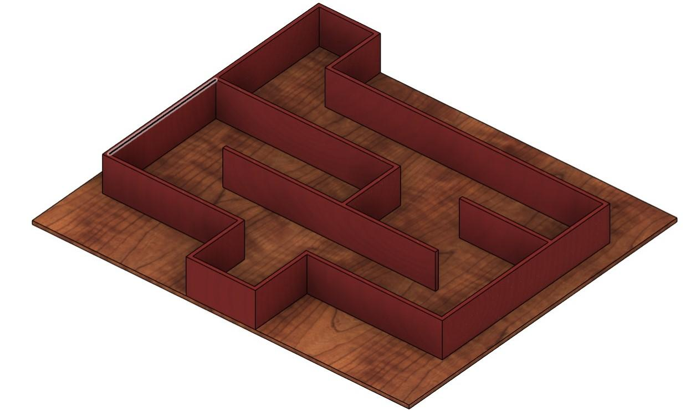
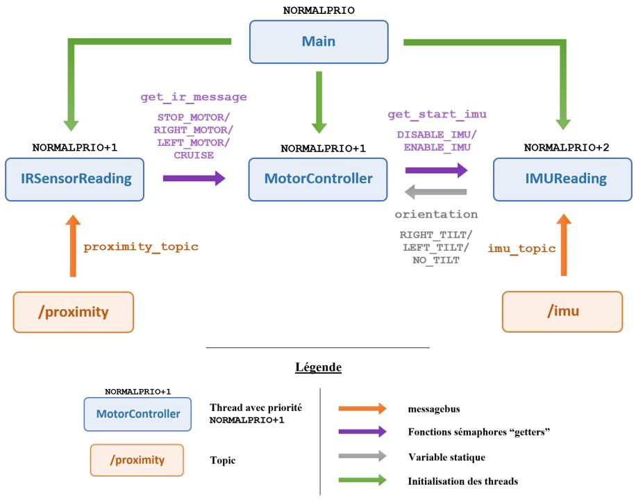

# MazeRover project repository branch:
- La branche rendu_miniprojet_2024 présente le MazeRover project réalisé dans le cadre du cours de Systèmes Embarqués et Robotique pour la section de Microtechnique.
- Notre projet, intitulé MazeRover, utilise le robot e-puck que nous avons programmé pour fonctionner comme un rover semi-autonome capable de naviguer dans un labyrinthe. La conception évoque l’image d’une boule se déplaçant librement à travers un parcours. Le robot, propulsé par le système d’exploitation temps réel ChibiOS, avance dans un labyrinthe portable jusqu’à rencontrer un obstacle frontal. La direction à prendre pour continuer son parcours est alors déterminée par l’inclinaison du labyrinthe, ajustée manuellement par l’utilisateur.
- L’objectif principal du MazeRover est de pouvoir naviguer d’un point A à un point B selon 3 itinéraires possibles, sans collisions, en gérant de manière autonome les ajustements nécessaires pour éviter les parois du labyrinthe.

# MazeRover - Embedded System for e-puck2  

## 📌 Project Overview  
This project, **MazeRover**, was developed as part of the **EPFL MICRO-315 - Embedded Systems & Robotics** course. It features the **e-puck2** robot programmed to navigate a portable **labyrinth** in a **semi-autonomous** manner using **real-time control with ChibiOS RTOS**.  

The system leverages **infrared proximity sensors** and an **IMU accelerometer** to detect obstacles and adjust its trajectory. The labyrinth’s **inclination**, manually controlled by the user, influences the robot’s movement path.

---

## 📷 Project Demonstration  
### Robot navigating the maze  
  

### MDF Maze Design  
  

---

## 🎯 Features  
✔ **Semi-Autonomous Navigation** – The robot moves through the maze and reacts to obstacles.  
✔ **Real-Time Embedded System** – Runs on **ChibiOS RTOS**, ensuring precise multitasking.  
✔ **Infrared Proximity Sensors** – Detects obstacles and prevents collisions.  
✔ **IMU-Based Control** – Uses an accelerometer to adjust movement based on labyrinth inclination.  
✔ **Multithreading Implementation** – Efficient thread management for real-time execution.  

---

## 🛠 Hardware & Software  
### **Hardware Components**  
- **e-puck2 robot**  
- **Infrared proximity sensors** (front, left, and right)  
- **IMU (Inertial Measurement Unit)** for inclination detection  
- **MDF-based labyrinth** for navigation testing  

### **Software & Tools**  
- **ChibiOS RTOS** (Real-Time Operating System)  
- **C programming** for firmware development  
- **Git & GitHub** for version control  
- **Fusion 360** for labyrinth design  

---

## 🧩 System Architecture & Multithreading  
The system is divided into **modular components**, each running in its own **thread** under ChibiOS:

1. **Main Thread** – Initializes system components and manages communication.  
2. **IR Sensor Thread** – Reads proximity data and prevents collisions.  
3. **Motor Controller Thread** – Adjusts motor speeds based on sensor inputs.  
4. **IMU Thread** – Detects inclination and updates movement strategy.  

### **Multithreading Logic**


---

## 🚀 Navigation Strategy  
The **MazeRover** follows **three predefined paths** (Red, Green, Blue) inside the labyrinth. The robot adapts its movement to avoid collisions while progressing toward its goal.


Key control strategies include:  
✔ **Obstacle Avoidance** – Adjusts speed based on infrared sensor input.  
✔ **Smooth Navigation** – Applies speed corrections to avoid erratic movements.  
✔ **Inclination-Based Turning** – Uses IMU data to determine turns.  

---

## 🛑 Challenges & Improvements  
### 🔴 **Difficulties Faced**  
- **Sensor Calibration** – Variability in IR sensor readings required fine-tuning.  
- **Battery Fluctuations** – Voltage drops affected sensor performance.  
- **Multithreading Complexity** – Managing real-time execution required careful thread priority tuning.  

### ✅ **Future Improvements**  
- **Better Sensor Integration** – Explore alternative sensors for improved accuracy.  
- **Automated Path Planning** – Implement AI-based decision-making for optimal navigation.  
- **Wireless Control** – Enable remote monitoring and commands via Bluetooth or WiFi.  

---

## 📂 Repository Structure  
```plaintext
📦 MazeRover
 ┣ 📂 src                                  # Source code for the e-puck2 firmware
 ┣ 📂 images                               # Photos, diagrams, and visualizations
 ┣ 📜 README.md                            # Readme file
 ┣ 📜 Robotique_Projet_Rapport.pdf         # Report of the project
