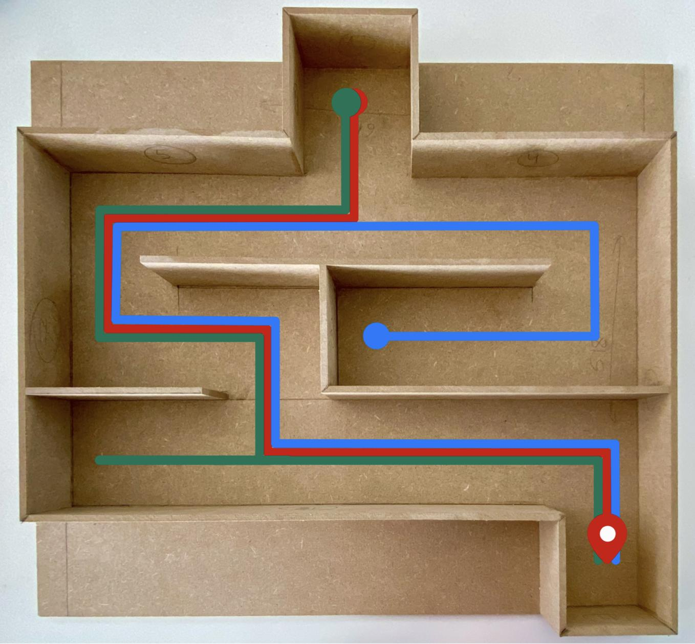

# MazeRover - Embedded System for e-puck2  

## Project Overview  
This project, **MazeRover**, was developed as part of the **EPFL MICRO-315 - Embedded Systems & Robotics** course. It features the **e-puck2** robot programmed to navigate a portable **labyrinth** in a **semi-autonomous** manner using **real-time control with ChibiOS RTOS**.  

The system leverages **infrared proximity sensors** and an **IMU accelerometer** to detect obstacles and adjust its trajectory. The labyrinth’s **inclination**, manually controlled by the user, influences the robot’s movement path.

---

## Project Demonstration  
### Robot navigating the maze  
  

### MDF Maze Design  
  

---

## Features  
✔ **Semi-Autonomous Navigation** – The robot moves through the maze and reacts to obstacles.  
✔ **Real-Time Embedded System** – Runs on **ChibiOS RTOS**, ensuring precise multitasking.  
✔ **Infrared Proximity Sensors** – Detects obstacles and prevents collisions.  
✔ **IMU-Based Control** – Uses an accelerometer to adjust movement based on labyrinth inclination.  
✔ **Multithreading Implementation** – Efficient thread management for real-time execution.  

---

## Hardware & Software  
### **Hardware Components**  
- **e-puck2 robot**  
- **Infrared proximity sensors** (front, left, and right)  
- **IMU (Inertial Measurement Unit)** for inclination detection  
- **MDF-based labyrinth** for navigation testing  

### **Software & Tools**  
- **ChibiOS RTOS** (Real-Time Operating System)  
- **C programming** for firmware development  
- **Git & GitHub** for version control  
- **Fusion 360** for labyrinth design  

---

## System Architecture & Multithreading  
The system is divided into **modular components**, each running in its own **thread** under ChibiOS:

1. **Main Thread** – Initializes system components and manages communication.  
2. **IR Sensor Thread** – Reads proximity data and prevents collisions.  
3. **Motor Controller Thread** – Adjusts motor speeds based on sensor inputs.  
4. **IMU Thread** – Detects inclination and updates movement strategy.  

### **Multithreading Logic**


---

## Navigation Strategy  
The **MazeRover** follows **three predefined paths** (Red, Green, Blue) inside the labyrinth. The robot adapts its movement to avoid collisions while progressing toward its goal.



Key control strategies include:  
✔ **Obstacle Avoidance** – Adjusts speed based on infrared sensor input.  
✔ **Smooth Navigation** – Applies speed corrections to avoid erratic movements.  
✔ **Inclination-Based Turning** – Uses IMU data to determine turns.  

---

## 📂 Repository Structure  
```plaintext
📦 MazeRover
 ┣ 📂 src                                  # Source code for the e-puck2 firmware
 ┣ 📂 images                               # Photos, diagrams, and visualizations
 ┣ 📜 README.md                            # Readme file
 ┣ 📜 Report_Robotics.pdf                  # Report of the project
